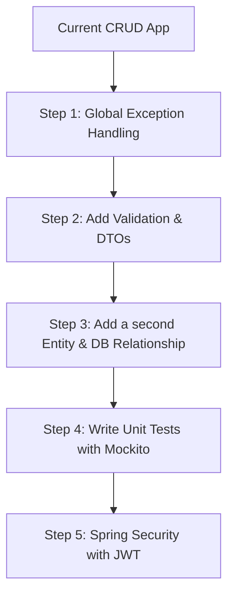

# Spring Boot Study & Interview Preparation Guide

This guide helps you assess what you currently have in your workspace, identifies the gaps required for junior/mid-level Java Spring Boot developer interviews, and provides a roadmap to enhance your project.

---

## 📊 Current Status of Your App

Your current project covers the fundamental pillars of a RESTful backend service:

| Layer / Topic | What You Have | Interview Relevance |
| :--- | :--- | :--- |
| **REST APIs** | Basic CRUD operations in [SoftwareEngineerController.java](file:///Users/bryanchau11/Documents/STUDY/Springboot/spring-boot/src/main/java/com/bryan/SoftwareEngineerController.java) | High (Core concept) |
| **Database** | PostgreSQL integration using Spring Data JPA in [SoftwareEngineerRepository.java](file:///Users/bryanchau11/Documents/STUDY/Springboot/spring-boot/src/main/java/com/bryan/SoftwareEngineerRepository.java) | High (Database connectivity) |
| **Caching** | Basic memory caching using Spring Cache in [CacheConfig.java](file:///Users/bryanchau11/Documents/STUDY/Springboot/spring-boot/src/main/java/com/bryan/CacheConfig.java) | Medium-High (System design / Performance) |
| **Deployment** | PostgreSQL in Docker via [docker-compose.yml](file:///Users/bryanchau11/Documents/STUDY/Springboot/spring-boot/docker-compose.yml) | Medium (DevOps / Local environment setup) |

> [!NOTE]
> This is a **perfect starting point** for understanding how layers (Controller ➡️ Service ➡️ Repository ➡️ DB) talk to each other. However, to pass technical interviews, you will need to expand this application to cover production-grade patterns.

---

## 🔍 Key Knowledge Areas & Gaps for Interviews

Here are the critical topics interviewers will ask about, ranked by priority:

### 1. Spring Core & Dependency Injection (DI)
Interviewers love asking how Spring works under the hood.
* **Concepts to study:**
  * Inversion of Control (IoC) & Dependency Injection (DI).
  * Bean Scopes (Singleton, Prototype, Request, Session).
  * Lifecycle of a Bean (`@PostConstruct`, `@PreDestroy`).
  * Difference between `@Component`, `@Service`, `@Repository`, and `@Controller`.
* **Current project state:** You are using constructor injection in [SoftwareEngineerController](file:///Users/bryanchau11/Documents/STUDY/Springboot/spring-boot/src/main/java/com/bryan/SoftwareEngineerController.java#L12) which is the industry best practice (as opposed to field injection using `@Autowired`).

### 2. Validation & Exception Handling ⚠️
Currently, if an engineer is not found, you throw a generic `RuntimeException` which returns an ugly 500 Internal Server Error page to the client.
* **What you need to add:**
  * **Global Exception Handler:** Create a class annotated with `@RestControllerAdvice` and methods with `@ExceptionHandler` to return neat, custom JSON error responses (e.g., 404 Not Found with a message).
  * **Input Validation:** Use `jakarta.validation` annotations (like `@NotNull`, `@Size`, `@Min`) on your request bodies to validate inputs before they reach the controller.

### 3. Data Transfer Objects (DTOs) & Layer Separation
Currently, your REST API receives and returns the database `@Entity` ([SoftwareEngineer.java](file:///Users/bryanchau11/Documents/STUDY/Springboot/spring-boot/src/main/java/com/bryan/SoftwareEngineer.java)) directly. This is considered an anti-pattern in production.
* **Why it's a gap:**
  * Database schemas should not be exposed directly to the outside API.
  * You might want to omit sensitive fields (like passwords) or format data differently for response representation.
* **What you need to add:**
  * Create DTO classes (e.g., `SoftwareEngineerRequestDto`, `SoftwareEngineerResponseDto`).
  * Implement mapping logic to convert between Entity and DTO (manually or using libraries like MapStruct).

### 4. Advanced JPA & Database Relationships 🔗
Real-world systems rarely have only one table.
* **Concepts to study:**
  * **Relationships:** `@OneToMany`, `@ManyToOne`, `@ManyToMany`.
  * **The N+1 Query Problem:** How Hibernate fetches lazy collections and how to solve it using `JOIN FETCH` or `@EntityGraph`.
  * **Transactions:** The `@Transactional` annotation (propagation types, isolation levels, and read-only flags).
* **What you need to add:**
  * Create another entity (e.g., `Project` or `Department`) and link it to `SoftwareEngineer` using a `@ManyToOne` or `@ManyToMany` relationship.

### 5. Automated Testing (Unit & Integration) 🧪
Companies expect developers to write tests.
* **Concepts to study:**
  * Unit Testing with **JUnit 5** and **Mockito** (mocking repositories/services).
  * Integration Testing with `@SpringBootTest` or using **Testcontainers** to spin up real databases during tests.
* **Current project state:** You have a default [ApplicationTests.java](file:///Users/bryanchau11/Documents/STUDY/Springboot/spring-boot/src/test/java/com/bryan/ApplicationTests.java) that only verifies if the application context loads. You should add mock tests for [SoftwareEngineerService](file:///Users/bryanchau11/Documents/STUDY/Springboot/spring-boot/src/main/java/com/bryan/SoftwareEngineerService.java).

### 6. Spring Security 🔒
Almost every enterprise app needs security.
* **Concepts to study:**
  * Spring Security Filter Chain.
  * Stateless Authentication using JWT (JSON Web Tokens).
  * Role-Based Access Control (RBAC) using `@PreAuthorize`.

---

## 🛠️ Step-by-Step Roadmap to Level Up Your Project

Here is a roadmap of features we can build step-by-step to make your app "interview-ready":

### Proposed Action Items:
1. **Step 1:** Implement a custom exception (e.g., `ResourceNotFoundException`) and a global exception handler.
2. **Step 2:** Refactor the API to use a `SoftwareEngineerDTO` and add validation (e.g. name cannot be empty).
3. **Step 3:** Introduce a `Department` entity. Every `SoftwareEngineer` belongs to a `Department` (`@ManyToOne`). We will write a query to fetch them efficiently without causing the N+1 problem.
4. **Step 4:** Write unit tests for your service class using JUnit and Mockito.

---

> [!TIP]
> If you'd like to work through these steps one by one, tell me which step you'd like to start with, and we can begin refactoring together!
